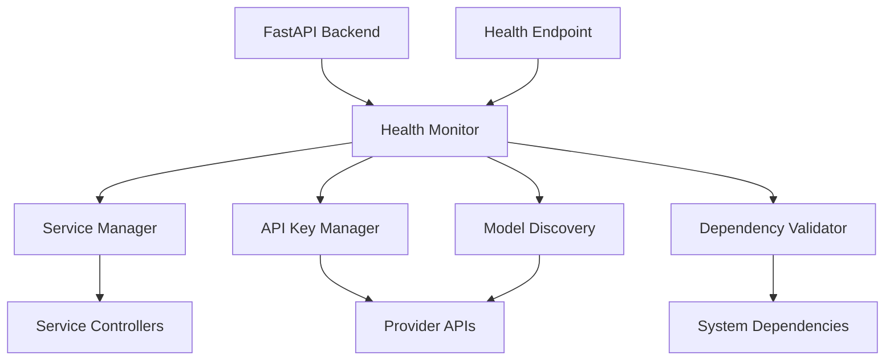

# Design Document

## Overview

The health monitoring system has several critical issues that prevent proper functionality:

1. **Health Endpoint Issues**: The health page fails to load or display incorrect information
2. **API Key Validation Failures**: Valid API keys are not being validated correctly
3. **Model Discovery Problems**: Models are not found even with valid API keys
4. **Error Handling Gaps**: Poor error reporting makes troubleshooting difficult

This design addresses these issues through targeted fixes to the existing health monitoring architecture while maintaining backward compatibility.

## Architecture

The health monitoring system follows a modular architecture with these key components:



### Current Issues Analysis

1. **Health Endpoint**: Missing proper integration with FastAPI backend
2. **API Key Validation**: Timeout issues and incorrect error handling
3. **Model Discovery**: Dependency on API key validation that's failing
4. **Error Propagation**: Errors not properly surfaced to users

## Components and Interfaces

### 1. Health Endpoint Integration

**Problem**: Health endpoint not properly integrated with health monitoring system

**Solution**: Create proper FastAPI endpoint that integrates with HealthMonitor

```python
@app.get("/health")
async def health_check():
    # Current: Simple status response
    # Fixed: Full health monitoring integration
    health_monitor = get_health_monitor_instance()
    status = await health_monitor.check_system_health()
    return status
```

### 2. API Key Manager Fixes

**Problem**: Validation timeouts and incorrect error handling

**Solution**: 
- Increase timeout values for API validation
- Add retry logic for network failures
- Improve error messages with specific failure reasons
- Add connection pooling for better performance

**Key Changes**:
- Extend timeout from 10s to 30s for initial validation
- Add exponential backoff for retries
- Separate network errors from authentication errors
- Cache validation results longer (6 hours instead of 1 hour)

### 3. Model Discovery Service Improvements

**Problem**: Model discovery fails when API keys are valid but validation reports them as invalid

**Solution**:
- Fix dependency chain between API validation and model discovery
- Add fallback mechanisms for known model lists
- Improve error handling and user feedback
- Add model caching to reduce API calls

### 4. Enhanced Error Handling

**Problem**: Generic error messages that don't help users troubleshoot

**Solution**:
- Structured error responses with error codes
- Actionable error messages with suggested fixes
- Detailed logging for debugging
- User-friendly error display in health page

## Data Models

### Enhanced Error Response Model

```python
@dataclass
class DetailedError:
    error_code: str
    component: str
    message: str
    suggested_action: str
    technical_details: Optional[str] = None
    timestamp: datetime = field(default_factory=datetime.now)
```

### API Key Validation Result

```python
@dataclass
class ValidationResult:
    provider: APIProvider
    is_valid: bool
    error_type: Optional[str] = None  # 'network', 'auth', 'timeout', 'unknown'
    error_message: Optional[str] = None
    response_time: Optional[float] = None
    last_validated: datetime = field(default_factory=datetime.now)
```

## Error Handling

### 1. API Key Validation Errors

**Network Errors**:
- Timeout: "Unable to connect to {provider} API. Check internet connection."
- Connection refused: "{provider} API is temporarily unavailable. Try again later."
- DNS resolution: "Cannot resolve {provider} API endpoint. Check network settings."

**Authentication Errors**:
- Invalid key: "API key for {provider} is invalid. Please check your key."
- Expired key: "API key for {provider} has expired. Please renew your key."
- Rate limited: "API key for {provider} is rate limited. Wait before retrying."

### 2. Model Discovery Errors

**No Valid Keys**:
- "No valid API keys found. Please configure at least one provider."

**Discovery Failed**:
- "Model discovery failed for {provider}: {specific_error}"

**Partial Success**:
- "Models discovered from {successful_count}/{total_count} providers."

### 3. Health Check Errors

**Service Down**:
- "Service {service_name} is not responding. Check if it's running on port {port}."

**Dependency Missing**:
- "Missing dependency: {dependency}. Run: {install_command}"

## Testing Strategy

### 1. Unit Tests

**API Key Manager Tests**:
- Test validation with valid/invalid keys
- Test timeout handling
- Test retry logic
- Test error message formatting

**Model Discovery Tests**:
- Test discovery with valid keys
- Test fallback to cached models
- Test error handling for failed discovery

**Health Monitor Tests**:
- Test system health aggregation
- Test error collection and reporting
- Test status determination logic

### 2. Integration Tests

**End-to-End Health Check**:
- Test complete health check flow
- Test error propagation from components to API
- Test health page rendering with various states

**API Key Validation Flow**:
- Test key validation through health endpoint
- Test model discovery after key validation
- Test error handling in complete flow

### 3. Error Scenario Tests

**Network Failure Simulation**:
- Test behavior when APIs are unreachable
- Test timeout handling
- Test retry mechanisms

**Invalid Configuration Tests**:
- Test behavior with missing configuration
- Test behavior with malformed API keys
- Test dependency validation failures

## Implementation Approach

### Phase 1: Core Fixes
1. Fix health endpoint integration
2. Improve API key validation timeouts and error handling
3. Add proper error propagation to health endpoint

### Phase 2: Enhanced Features
1. Implement detailed error reporting
2. Add model discovery improvements
3. Enhance user feedback mechanisms

### Phase 3: Robustness
1. Add comprehensive error handling
2. Implement retry mechanisms
3. Add performance optimizations

## Backward Compatibility

All changes maintain backward compatibility:
- Existing API endpoints continue to work
- Configuration format remains the same
- Error responses are enhanced but maintain basic structure
- No breaking changes to public interfaces